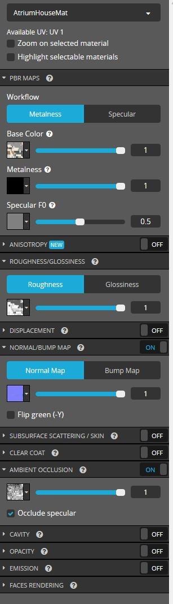
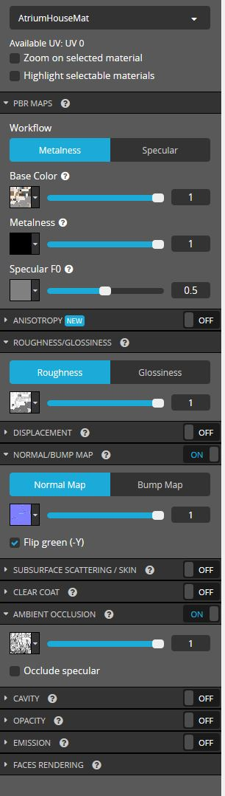

# Issues with glTF Exporter Texture Sizes

The Blender, Sketchfab, Spoke glTF exporters produce textures that are significantly different than the source assets.

This repository contains source and exported assets to try to hunt down these bugs.

# Blender to glTF

Source .blend file was exported to .gltf in Blender 2.8 (glTF Separate (.gltf + .bin + textures) and Vertex Colors + Animations turned off).

The textures sizes were then compared.

The source assets can be found in [SourceBlend](./SourceBlend).

The exported assets can be found in [BlendToGLTF](./BlendToGLTF).

## Results

| Texture Type | Source Size         | Exported glTF Size       | % Change      |
|--------------|---------------------|--------------------------|---------------|
| Base Color   | 553,444 (553 K)     | 1,000,556B (1MB)         | 80.8% Bigger  |
| Normal       | 2,796,605 (2.8 MB)  | 7,754,049B (7.8MB)       | 63.9% Bigger  |
| ORM          | 4,966,675 (5 MB)    | 11,990,492B (12MB)       | 141.4% Bigger |

# Modified Blender glTF to Sketchfab glTF (Auto Generated)

Because the Blender exporter increased the texture sizes, we exported to .gltf in Blender 2.8 and replaced the exported textures with the original textures before uploading. Now we can isolate the change in texture size to Sketchfab's glTF importer and exporter.

We then uploaded the modified glTF files to Sketchfab.

We used the default material settings in Sketchfab's material editor:

We then downloaded the auto-generated glTF asset.

The texture sizes were then compared.

The uploaded assets can be found in [ModifiedGLTF](./ModifiedGLTF).

The downloaded assets can be found in [ModifiedGLTFToSketchfabGLTF](./ModifiedGLTFToSketchfabGLTF).

## Results

| Texture Type | Source Size         | Auto Generated glTF Size | % Change      |
|--------------|---------------------|--------------------------|---------------|
| Base Color   | 553,444 (553 K)     | 1,591,268B (1.6MB)       | 187.5% Bigger |
| Normal       | 2,796,605 (2.8 MB)  | 2,992,909B (3MB)         | 7% Bigger     |
| ORM          | 4,966,675 (5 MB)    | 5,411,633B (5.4MB)       | 8.9% Bigger   |

# FBX to Sketchfab glTF (Auto Generated)

The source .blend file was exported to .fbx and then imported into Sketchfab.
The ORM map was split into individual channels in Photoshop and exported as 8bit PNGs without transparency.

Each ORM channel was manually set in the Sketchfab's material editor:

The source texture sizes were then compared against the textures of Sketchfab's auto-generated glTF.

The source ORM texture sizes were summed before being compared to the auto-generated ORM texture. Each file's size can be seen in the table below.

The uploaded assets can be found in [BlendToFBX](./BlendToFBX).

The downloaded assets can be found in [FBXToSketchfabGLTF](./FBXToSketchfabGLTF).

## Results

| Texture Type | Source Size              | Auto Generated glTF Size  | % Change      |
|--------------|--------------------------|---------------------------|---------------|
| Base Color   | 553,444 (553 K)          | 1,577,234 (1.6 MB)        | 184.9% Bigger |
| Normal       | 2,796,605 (2.8 MB)       | 2,995,794B (3 MB)         | 7.1% Bigger   |
| Metallic     | 2,160 (2 K)              | N/A                       | N/A           |
| Roughness    | 3,098,680 (3.1 MB)       | N/A                       | N/A           |
| Occlusion    | 4,914,548 (4.9 MB)       | N/A                       | N/A           |
| ORM          | 8,015,388 (8 MB) (Total) | 11,078,986B (11 MB)       | 38.2% Bigger  |

# Modified Blender glTF to Spoke glTF Export

Spoke supports importing glb assets, but not glTF so we converted the [modified glTF assets](./ModifiedGLTF) to glb using the Visual Studio Code glTF extension. The resulting .glb file has approximately the same file size as the source assets so we can assume that there were no changes to the texture file sizes during this step.

We then uploaded the glb asset to Spoke and cleared out all other objects in the scene. We then exported the glb file from Spoke.

The base color map was converted to a png due to a bug in Spoke.

The source assets can be found in [ModifiedGLTF](./ModifiedGLTF).

The uploaded assets (after conversion to glb) can be found in [ModifiedGLTFToGLB](./ModifiedGLTFToGLB).

The downloaded assets can be found in [SpokeToGLB](./SpokeToGLB).

The converted assets (glb to gltf) can be found in [SpokeGLBToGLTF](./SpokeGLBToGLTF).

## Results

| Texture Type | Source Size         | glTF Size                | % Change       |
|--------------|---------------------|--------------------------|----------------|
| Base Color   | 553,444 (553 K)     | 6,622,324B (6.6MB)       | 1096.6% Bigger |
| Normal       | 2,796,605 (2.8 MB)  | 5,604,412B (5.6MB)       | 100% Bigger    |
| ORM          | 4,966,675 (5 MB)    | 7,925,664B (7.9MB)       | 59.6% Bigger   |